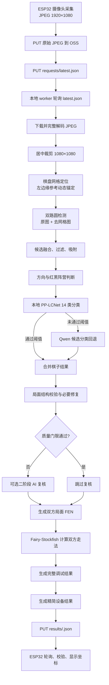

# 象棋识别全流程技术文档

> 项目：ChessAssistantCode<br>
> 文档基线：2026-10-07 当前本地代码与运行配置<br>
> 目标设备：ESP32-S3 摄像头棋盘终端<br>
> 云端存储：阿里云 OSS<br>
> 本地识别节点：Windows worker

## 1. 文档目的

本文整理当前象棋识别系统从设备拍照、图像上传、图像预处理、棋盘坐标定位、棋子检测与分类、局面校验、走法计算，到结果回传和设备显示的完整技术流程。

本文描述的是当前实际运行方案：

- ESP32 上传摄像头直接输出的 1920×1080 JPEG，不在设备端裁剪。
- worker 下载图像后居中裁剪为 1080×1080。
- OpenCV 透视矫正当前关闭，直接在 1080×1080 图像上定位棋盘网格。
- 第一条坐标竖线以 1080×1080 图像左边缘为基准动态查找。
- 棋子优先由本地 PP-LCNet 14 类分类器识别。
- 本地分类置信度阈值当前为 0.50，类别差值阈值为 0.10。
- 本地未通过的候选才回退到 Qwen 视觉模型。
- 合法局面交给 Fairy-Stockfish 计算双方推荐走法。
- worker 向设备上传精简结果，同时在本地保存完整诊断结果和叠加图。

## 2. 总体架构



## 3. 主要代码模块

| 模块 | 路径 | 作用 |
|---|---|---|
| 设备图像任务 | `main/APP/image_task.c` | 拍照、上传、发布清单、轮询结果 |
| OSS 客户端 | `main/APP/oss_client.c` | 构造 URL，执行 HTTPS PUT/GET |
| 设备结果解析 | `main/APP/image_result.c` | 解析结果 JSON 并执行严格一致性校验 |
| 设备配置 | `main/APP/app_config.h` | 超时、轮询周期、协议缓冲区等 |
| LCD 显示 | `main/APP/lvgl_app.c` | 接收回调并更新双方起点/终点坐标 |
| 本地 worker | `cloud/local_oss_ai_worker/worker.py` | 完整识别、校验、引擎和结果写回流程 |
| 本地分类适配器 | `cloud/local_oss_ai_worker/local_piece_classifier.py` | PP-LCNet 推理、置信度过滤、分类报告 |
| 分类器工程 | `cloud/local_piece_classifier/` | 训练、微调、导出、评估和单图测试 |
| worker 配置 | `cloud/local_oss_ai_worker/.env` | 当前运行参数和凭据，禁止提交到 Git |
| worker 使用说明 | `cloud/local_oss_ai_worker/README.md` | 部署、环境变量和运行方法 |

## 4. 标识符和 OSS 对象协议

### 4.1 设备与帧标识

- `device_id`：由设备 Wi-Fi STA 完整 MAC 生成，例如 `chess-441BF68B2D54`。
- `session_id`：设备本次运行会话标识。
- `sequence`：当前会话中的递增帧序号。
- `frame_id`：通常由 `device_id-session_id-sequence` 组成，例如：

```text
chess-441BF68B2D54-4D0C5644-000001
```

### 4.2 OSS 对象路径

```text
devices/<device_id>/requests/<frame_id>.jpg
devices/<device_id>/requests/latest.json
devices/<device_id>/results/<frame_id>.json
devices/<device_id>/heartbeat.json
```

设备先上传 JPEG，再覆盖 `latest.json`。这样 worker 只有在图像对象已经存在后才会看到新任务。

### 4.3 请求清单结构

设备发布的 `latest.json` 包含：

```json
{
  "protocol_version": 1,
  "device_id": "chess-XXXXXXXXXXXX",
  "session_id": "4D0C5644",
  "frame_id": "chess-XXXXXXXXXXXX-4D0C5644-000001",
  "sequence": 1,
  "status": "pending",
  "image_key": "devices/.../requests/<frame_id>.jpg",
  "result_key": "devices/.../results/<frame_id>.json",
  "image_width": 1920,
  "image_height": 1080
}
```

## 5. ESP32 图像采集与上传

### 5.1 采集方式

当前固件通过 `camera_capture_for_upload()` 获取摄像头 JPEG 帧：

- 分辨率：1920×1080。
- 格式：`PIXFORMAT_JPEG`。
- 上传内容：摄像头原始 JPEG 字节。
- 设备端不执行 1080×1080 裁剪，也不进行 RGB 转 JPEG。

设备拿到帧后把 JPEG 复制到独立上传缓冲区，再及时释放摄像头帧缓冲区。

### 5.2 上传顺序

1. 生成 `frame_id`。
2. 上传原始 JPEG 到 `requests/<frame_id>.jpg`。
3. 上传 `requests/latest.json`。
4. 进入结果等待状态。
5. 每 1 秒请求一次 `results/<frame_id>.json`。
6. 最长等待 480 秒。

当前 `IMAGE_TRAINING_MODE_ENABLED=0`，所以设备上传后会等待识别结果；训练模式开启时才会跳过结果轮询。

### 5.3 上传重试与提示

- JPEG 和 JSON 均带重试机制。
- 上传成功后设备蜂鸣一次。
- 结果校验成功后再次蜂鸣，并调用显示回调。

## 6. worker 任务发现与去重

worker 启动后：

1. 从 `.env` 读取 OSS、设备列表、AI、分类器和引擎配置。
2. 轮询每个设备的 `requests/latest.json`。
3. 组合 `device_id:frame_id:sequence` 形成状态键。
4. 与 `.oss_ai_worker_state.json` 中的 `last_processed` 比较。
5. 相同则跳过；不同则进入处理流程。

当前运行对象：

```text
OSS_BUCKET=esp32-chess-assistant
OSS_REGION=cn-hangzhou
DEVICE_IDS=chess-441BF68B2D54
DISCOVER_DEVICES=false
```

## 7. 图像下载、完整性验证与居中裁剪

### 7.1 完整解码

worker 下载 OSS JPEG 后使用 Pillow 打开并执行完整解码。损坏或截断 JPEG 会在这一阶段失败，不会继续送入识别流程。

曾出现过固定为 131072 字节、缺少 JPEG `FFD9` 结束标记的截断图。根因是设备端 RGB 转 JPEG 使用固定缓冲区。当前已经恢复为摄像头 JPEG 直接上传，因此不再使用该转换路径。

### 7.2 1080×1080 居中裁剪

对 1920×1080 原图执行：

```text
left   = (1920 - 1080) / 2 = 420
top    = 0
right  = 1500
bottom = 1080
```

得到 1080×1080 JPEG，默认质量为 95。后续棋盘定位、圆检测和分类均使用这张裁剪图。

必须区分两种尺寸：

- 识别图尺寸：1080×1080。
- 设备协议尺寸：仍为原始清单中的 1920×1080。

设备会严格校验返回尺寸。若 worker 返回 1080×1080，设备会报 `ESP_ERR_INVALID_RESPONSE`，不会触发显示回调。因此 `build_device_result()` 必须返回原始清单尺寸。

## 8. 棋盘几何和坐标网格定位

### 8.1 棋盘规格

中国象棋棋盘包含：

- 9 条竖向坐标线，即 8 个横向格距。
- 10 条横向坐标线，即 9 个纵向格距。
- 棋盘坐标范围：`x=0..8`、`y=0..9`。

### 8.2 当前透视策略

当前配置：

```text
CHESS_OPENCV_RECTIFY_BOARD=false
```

因此 worker 不执行透视拉正，直接在居中裁剪后的 1080×1080 图像上检测网格。代码仍保留透视矫正能力，可通过配置重新启用。

### 8.3 霍夫线与等距网格拟合

`detect_rectified_grid_crop()` 的主要步骤：

1. 灰度化和轻度高斯模糊。
2. Canny 边缘检测。
3. `HoughLinesP` 检测横线和竖线。
4. 按位置和线段长度形成加权线簇。
5. 分别拟合 9 条竖线和 10 条横线的等距序列。
6. 使用棋子圆心对候选几何进行辅助检查和微调。

### 8.4 第一条竖线的左边缘参考锚定

为避免霍夫拟合漏掉最左侧竖线并把右侧棋盘外框当成第 9 条线，第一条竖线不再依赖“当前错误网格再左移一格”，而是直接以 1080×1080 图像左边缘 `x=0` 为参考。

标准相对位置：

```text
DEFAULT_BOARD_GRID_LEFT = 0.117
expected_x = image_width × 0.117
```

对于 1080 像素宽图像：

```text
expected_x = 1080 × 0.117 = 126.36 px
```

动态搜索半径为以下数值的最大值：

```text
max(
    8 px,
    image_width × 0.03,
    current_grid_spacing × 0.25
)
```

典型 1080×1080 图像中的搜索半径为 32.4 像素，搜索区间约为：

```text
x = 93.96 .. 158.76
```

窗口内竖线还必须满足动态强度阈值：

```text
minimum_weight = image_width × 0.50
```

从合格竖线中选择最接近 `expected_x` 的线作为 `x=0` 锚点，再按拟合出的格距生成其余 8 条竖线。该锚点会被保留，不允许后续圆心拟合覆盖。

相关环境变量：

```text
CHESS_GRID_ANCHOR_LEFT_REFERENCE=true
CHESS_GRID_LEFT_REFERENCE_RATIO=0.117
CHESS_GRID_LEFT_REFERENCE_SEARCH_IMAGE_RATIO=0.03
CHESS_GRID_LEFT_REFERENCE_SEARCH_SPACING_RATIO=0.25
CHESS_GRID_LEFT_REFERENCE_MIN_WEIGHT_RATIO=0.50
```

### 8.5 最近一次实测网格

帧 `chess-441BF68B2D54-4D0C5644-000001`：

```text
left   = 118.65
top    = 78.78
right  = 925.57
bottom = 978.91
cell_width  = 100.86 px
cell_height = 100.01 px
```

第一竖线理论位置为 126.36，实际找到 118.65，偏差 -7.71 像素，处于动态查找范围内。

## 9. 棋子候选检测

### 9.1 双路圆检测

worker 对两张图并行执行圆检测：

1. 原始彩色裁剪图。
2. 去除棋盘网格线后的图。

去网格图通过在理论 9×10 网格位置生成线掩模并进行修复得到，可降低棋盘线对棋子圆边缘的干扰。

### 9.2 候选融合

两路圆根据以下信息融合：

- 圆心距离。
- 半径比例。
- 圆环边缘覆盖率。
- 棋子区域亮度、对比度和纹理。
- 与最近棋盘交叉点的偏移。
- 网格 ROI 与霍夫圆的综合得分。

不符合尺寸、位置、边缘完整性或棋子外观条件的圆会被拒绝。

### 9.3 网格吸附

通过筛选的圆心被映射到最近棋盘交叉点，并记录：

- `circle_id`
- `cx`、`cy`、`radius`
- `board_x`、`board_y`
- `grid_cx`、`grid_cy`
- `grid_offset_x`、`grid_offset_y`
- 检测来源和质量分数

最终棋子坐标来源标记为：

```text
piece_coordinate_source = worker_grid_from_cxcy
```

## 10. 棋盘方向和坐标系统

worker 使用棋子文字区域的红黑颜色分布判断哪一方位于图像底部：

- 红方逻辑名：`shuai`。
- 黑方逻辑名：`jiang`。
- 当前设备结果使用 `player_local` 坐标。
- `player1=shuai`，`player2=jiang`。

底部阵营的棋子裁剪可旋转 180° 后再送入字符分类器，使训练集方向与推理方向一致。

完整结果中同时保留：

- `recommended_moves`：规范棋盘方向下的走法。
- `canonical_points`：规范坐标点。
- `points`：设备最终显示的双方本地坐标点。

## 11. 本地棋子分类器

### 11.1 模型

本地模型为微调后的 PP-LCNet x1.0，包含 14 类：

```text
red_shuai   black_jiang
red_shi     black_shi
red_xiang   black_xiang
red_ma      black_ma
red_che     black_che
red_pao     black_pao
red_bing    black_zu
```

默认模型目录：

```text
cloud/local_piece_classifier/output/
xiangqi_pplcnet_x1_0_finetune/inference
```

必须包含：

```text
inference.json
inference.pdiparams
```

### 11.2 推理输入

每个棋子以检测圆心和半径为依据裁剪：

- 默认裁剪比例：圆半径的 1.35 倍。
- 缩放到 160×160。
- 转为 RGB。
- 使用 ImageNet mean/std 归一化。
- 根据棋盘方向按需旋转 180°。

### 11.3 当前接受条件

```text
CHESS_LOCAL_CLASSIFIER_MIN_CONFIDENCE=0.50
CHESS_LOCAL_CLASSIFIER_MIN_MARGIN=0.10
```

只有同时满足以下条件才接受本地分类：

```text
top1_score >= 0.50
top1_score - top2_score >= 0.10
```

否则该 `circle_id` 会进入云端候选分类回退。

### 11.4 低阈值的权衡

阈值从 0.70 降至 0.50 后，典型一帧本地接受数从 18 个提高到 21 个，云端回退从 4 个减少到 1 个。

代价是错误分类更容易被直接接受。例如一枚实际红炮曾得到：

```text
top1 = red_xiang, score = 0.536768
top2 = red_shuai, score = 0.090682
margin = 0.446086
```

在 0.70 阈值下它会回退云端并识别为红炮；在 0.50 阈值下会被本地直接接受为红相。当前配置优先减少云端回退，但必须继续观察误识别率。

### 11.5 推理后端

worker 支持：

- `inprocess`：worker 环境直接加载 Paddle。
- `subprocess`：启动持久分类服务进程。
- `auto`：优先直接加载，否则使用分类器虚拟环境中的 Python 子进程。

模型只加载一次，后续帧复用推理进程。

## 12. 云端视觉模型

当前配置：

```text
CHESS_AI_PROVIDER=qwen
CHESS_AI_MODEL=qwen3-vl-plus
```

云端视觉模型承担：

- 主图结构化视觉识别。
- 本地分类器拒绝候选的补充分类。
- 必要时的二阶段复核。

本地分类器通过的棋子不会再次进入普通云端候选分类。日志中的典型统计为：

```text
Candidate classification:
local_status=partial local=18 cloud_fallback=1 unclassified=0
```

## 13. 棋子结果合并和规则修正

本地与云端分类结果合并后，worker 会继续执行：

- 字符与红黑颜色冲突检查。
- 红黑颜色到 `shuai/jiang` 阵营映射。
- 将/帅候选隔离和王宫约束。
- 将/帅重复、缺失和宫外结果修正。
- 重复棋盘坐标检查。
- 棋子数量和可见候选覆盖率检查。
- 圆形视觉证据检查。

完整调试 JSON 会记录每一步的状态和调整清单，便于定位某个棋子为何被改名、改色、改阵营或拒绝。

## 14. 结构校验与二阶段复核

第一阶段结果会生成：

- `validation_status`
- `validation_errors`
- `candidate_coverage`
- `visual_evidence_status`
- `move_repair_status`

当前配置：

```text
CHESS_AI_ENABLE_REVIEW=true
CHESS_AI_REVIEW_MODE=auto
CHESS_AI_REVIEW_MIN_CONFIDENCE=0.85
CHESS_AI_REVIEW_MIN_ORIENTATION_CONFIDENCE=0.35
```

当结构校验、覆盖率、置信度和方向判断都通过时，日志显示：

```text
AI second-stage review skipped: first-stage quality gates passed
```

只有质量门限未通过时才执行二阶段复核，避免每帧重复调用云端模型。

## 15. Fairy-Stockfish 走法计算

当前配置启用了 Fairy-Stockfish：

```text
CHESS_ENGINE_ENABLED=true
CHESS_ENGINE_MOVETIME_MS=1500
```

处理步骤：

1. 把校验后的棋子列表转换为中国象棋 FEN。
2. 分别以 `shuai` 和 `jiang` 为走子方构造局面。
3. 向 UCI 引擎发送 Xiangqi variant、局面和思考时间。
4. 读取 `bestmove`。
5. 把引擎坐标转换为 worker 的 0 基棋盘坐标。
6. 写入 `engine_recommended_moves`。
7. 引擎成功时覆盖初步 `recommended_moves`。

当前 `CHESS_AI_SEPARATE_MOVE_DECISION=false`，启用引擎时不再执行冗余的独立 AI 走法决策。

## 16. 完整结果与设备精简结果

### 16.1 本地完整结果

本地 `.result.json` 包含：

- 棋子列表及圆检测信息。
- 网格几何和左边缘锚定报告。
- 方向判断证据。
- 本地分类器所有 top1/top2 分数。
- 云端回退统计。
- 规则修正记录。
- 结构校验与复核状态。
- FEN 和引擎结果。
- 各阶段耗时。

### 16.2 上传给设备的精简结果

为保证结果远小于 ESP32 的 8 KiB 接收缓冲区，只上传以下字段：

```json
{
  "protocol_version": 1,
  "device_id": "chess-XXXXXXXXXXXX",
  "session_id": "4D0C5644",
  "frame_id": "chess-XXXXXXXXXXXX-4D0C5644-000001",
  "sequence": 1,
  "status": "ok",
  "image_width": 1920,
  "image_height": 1080,
  "confidence": 0.92,
  "points": {
    "player1_start": {"x": 8, "y": 6},
    "player1_end": {"x": 8, "y": 5},
    "player2_start": {"x": 4, "y": 4},
    "player2_end": {"x": 4, "y": 5}
  }
}
```

典型精简结果约 338 字节。

## 17. ESP32 结果接收与显示

设备轮询结果 URL 时追加时间戳参数，降低缓存干扰：

```text
<result_url>?t=<current_time_ms>
```

HTTP 状态处理：

- `404`：结果尚未生成，继续轮询。
- `200`：解析并校验 JSON。
- `408/429/500/503`：视为暂时错误，继续等待。
- 其他状态：视为致命错误。

设备严格校验：

- `protocol_version == 1`
- `device_id` 一致
- `session_id` 一致
- `frame_id` 一致
- `sequence` 一致
- 返回尺寸与原始上传尺寸一致
- `status == ok`
- `confidence >= 0.50`
- 四个坐标点合法

全部通过后：

1. 状态变为 `IMAGE_TASK_STATE_RESULT_READY`。
2. 蜂鸣提示。
3. 调用 `image_result_callback()`。
4. LVGL 更新玩家 1 和玩家 2 的起点、终点坐标。

任一字段不一致都会导致结果被拒绝，不会显示。

## 18. 本地调试产物

调试目录：

```text
cloud/local_oss_ai_worker/debug/
```

每帧可能生成：

| 文件 | 内容 |
|---|---|
| `<frame_id>.jpg` | worker 实际处理的 1080×1080 居中裁剪图 |
| `<frame_id>.result.json` | 完整诊断结果 |
| `<frame_id>.overlay.jpg` | 网格、棋子分类和推荐走法叠加图 |
| `<frame_id>.candidates.jpg` | 候选棋子裁剪汇总图 |
| `<frame_id>.grid_suppressed.jpg` | 去除棋盘网格线后的图 |
| `<frame_id>.rectified.jpg` | 启用透视矫正且图像变化时保存 |
| `<frame_id>.candidate_crops/` | 每个候选棋子的独立裁剪图和元数据 |

叠加图约定：

- 蓝色线：棋盘 9×10 坐标网格。
- 绿色圆：接受的棋子候选。
- 黑色或红色标记：阵营和分类结果。
- 绿色连线：双方推荐走法。

## 19. 当前 worker 启动方式

```powershell
cd G:\1_Personal_File\chessAssistant\gitHub_Code\ChessAssistantCode\cloud\local_oss_ai_worker
.\.venv\Scripts\python.exe .\worker.py --env-file .env --debug-dir .\debug
```

常用检查：

```powershell
# 检查语法
.\.venv\Scripts\python.exe -m py_compile .\worker.py

# 查看最新完整结果
Get-ChildItem .\debug -Filter '*.result.json' |
  Sort-Object LastWriteTime -Descending |
  Select-Object -First 1

# 查看最新叠加图
Get-ChildItem .\debug -Filter '*.overlay.jpg' |
  Sort-Object LastWriteTime -Descending |
  Select-Object -First 1
```

## 20. 关键运行日志

正常处理一帧时主要日志顺序如下：

```text
New frame detected
Center crop complete
Image preprocessing status
Processing image locally
Grid ROI + Hough fusion accepted A/B candidates
Calling Qwen vision model
Candidate classification: local=... cloud_fallback=... unclassified=...
Recognition timings
AI second-stage review skipped / completed
Device result payload written
Result written
```

关键判断：

- 有 `New frame detected`：worker 已发现设备新任务。
- 有 `Center crop complete`：JPEG 可完整解码并完成裁剪。
- 有 `Result written`：结果已经成功写回 OSS。
- 只有本地 `result.json` 但没有 `Result written`：需要检查 OSS 上传错误。
- `unclassified > 0`：本地和云端都未能完成部分候选分类。

## 21. 已发现并处理的问题

### 21.1 JPEG 固定 131072 字节截断

现象：

- JPEG 文件固定为 131072 字节。
- 文件有 `FFD8` 开头但缺少 `FFD9` 结尾。
- Pillow 报图像截断。

处理：取消设备端裁剪和 RGB 转 JPEG，恢复摄像头原始 JPEG 直接上传；1080×1080 裁剪移到 worker。

### 21.2 设备收到结果但不显示

现象：worker 已写回 `status=ok`，设备仍不显示。

原因：worker 曾把裁剪尺寸 1080×1080 写入设备结果，而设备期待原始尺寸 1920×1080，严格校验失败。

处理：识别阶段使用 1080×1080；设备结果始终保留清单中的原始 1920×1080。

### 21.3 坐标网格横向偏右一格

现象：旧网格约为 `x=228..1033`，漏掉实际最左侧棋盘线，并在棋盘外增加一条线。

原因：霍夫拟合选中了错误的等距相位，棋盘外边缘被当作第 9 条竖线；后续圆心修正无法跨越完整一个格距。

处理：以 1080×1080 图像左边缘和 `0.117` 相对位置为标准，在动态窗口内重新锚定第一条竖线，并保护该锚点不被后续覆盖。

### 21.4 降低分类阈值后的误识别风险

现象：本地分类接受率提高、云端调用减少，但部分 0.50～0.70 的错误 top1 会被直接接受。

处理建议：

- 持续收集该置信度区间的误识别样本。
- 对混淆类别执行针对性再训练。
- 如果走法可靠性优先于云端调用成本，恢复到 0.60～0.70。
- 可按类别设置不同阈值，而不是所有类别统一使用 0.50。

## 22. 安全与运维要求

- `.env` 包含 OSS 和 AI 凭据，不得提交到 GitHub。
- 推荐使用最小权限 RAM 用户或临时 STS 凭据。
- 调试 JSON 可能包含完整棋局信息，公开前需要确认数据范围。
- 删除 OSS 图像前先核对完整对象键、文件大小和 JPEG 完整性。
- 删除最新图像但保留 `latest.json` 会形成悬空引用；下一次设备上传会自动覆盖。
- worker 重启后通过状态文件避免重复处理已经完成的帧。

## 23. 验收检查表

每次修改识别流程后至少检查：

- [ ] ESP32 上传的 JPEG 可完整解码，末尾包含 `FFD9`。
- [ ] 原图尺寸为 1920×1080。
- [ ] worker 裁剪区域为 `[420,0,1500,1080]`。
- [ ] 识别图尺寸为 1080×1080。
- [ ] 第一竖线落在相对参考动态窗口内。
- [ ] 9 条竖线和 10 条横线与实际棋盘线基本重合。
- [ ] 边缘棋子没有因 ROI 过窄而丢失。
- [ ] 本地分类报告显示预期的阈值和差值阈值。
- [ ] 云端回退数与本地拒绝数一致。
- [ ] `validation_status=structural_ok`。
- [ ] `engine_status=ok` 或有明确可解释的降级状态。
- [ ] 上传给设备的结果小于 8 KiB。
- [ ] 设备结果尺寸仍是 1920×1080。
- [ ] 设备成功触发结果回调并更新 LCD。
- [ ] 本地 `.overlay.jpg` 中网格、棋子和走法位置正确。

## 24. 后续优化建议

1. 为左边缘锚定、网格相位和协议尺寸建立自动化回归测试。
2. 在完整结果中为每枚棋子保留统一的最终分类来源字段，明确区分 `local_pplcnet`、`cloud_fallback` 和规则修正。
3. 针对 `red_pao/red_xiang` 等混淆类别补充困难样本训练。
4. 对 0.50～0.70 置信度区间做离线评估，再决定生产阈值。
5. 增加设备端“结果下载成功、解析成功、显示成功”的独立日志或状态回执。
6. 在 worker 启动时打印非敏感关键配置摘要，便于确认当前阈值、网格参数和引擎状态。
7. 为 OSS 结果对象增加生命周期管理，定期清理过期请求图、结果和调试副本。
